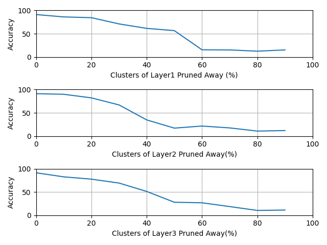
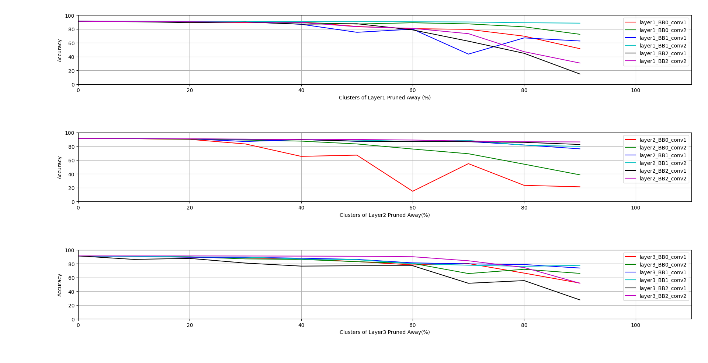

# 

The purpose of this repo is to demostrate accuracy in case of filter level pruning  of the ResNet20 for CIFAR10. The following model are desined by
author [Yerlan Idelbayev](https://github.com/akamaster/pytorch_resnet_cifar10.git) of "Proper {ResNet} Implementation for {CIFAR10/CIFAR100} in {PyTorch}"


| Name      | # layers | # params| Test err(paper) | Test err(this impl.)|
|-----------|---------:|--------:|:-----------------:|:---------------------:|
|[ResNet20](https://github.com/akamaster/pytorch_resnet_cifar10/raw/master/pretrained_models/resnet20-12fca82f.th)   |    20    | 0.27M   | 8.75%| **8.27%**|


## Parameters
Modify pytorch_resnet_cifar10/run.sh:

Training ResNet20 from scratch: 
* report=0

Calculate and plot accuracy for pruning layers1, layers2 and layers3 of ResNet20:
* report=1

Calculate and plot accuracy for pruning conv layers in ResNet20 in sequence:
* report=2

Plot accuracy for pruning layers1, layers2 and layers3 of ResNet20:nce
* report=3

Plot accuracy for pruning conv layers in ResNet20 in sequence:
* report=4


## How to run?
```bash
git clone https://github.com/akamaster/pytorch_resnet_cifar10
cd pytorch_resnet_cifar10
chmod +x run.sh && ./run.sh
```

# Figure 1. Accuracy in case of pruning convolutional layer1, layer2 and layer3 of ResNet20

# Figure 2. Accuracy in case of pruning convolutional layers of ResNet20 in sequence 


## Summary
 ResNets20 have threee stages of residual blocks for feature maps with channels of 16,32,64. We use K-means for clustering filters of convolutional layers. After clustering we replace all filters with centroids of clusters and estimate changes in accuracy. 

 Figure 1 shows the sensitivity of the accuracy of the network depending on number of cluster pruned away in the first, second and third stages. We can see that second and third stages are more sensitive to pruning than the first one. It could be explained by the level of semantics encoded in those layers. 

 Figure 2 shows accuracy of the network in case of pruning filters only in one particular convolutiuonal layer. We can see it especially on the second chart that the the first two layer of the second stage have higher impact on the accuracy of all network then other layers in this stage. This shows that some filters could be pruned away from the network without high degradation of the performance overall network. 

## TODO
 * Try different algorithms and metrics for clustering. 
 * Try different types of estimation filter importance.
 * Not pruning, but merging similar clusters.
 
 


